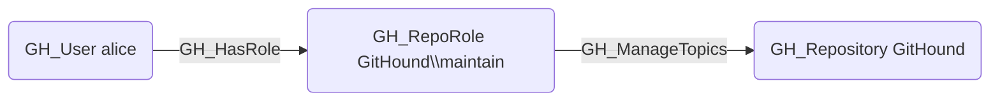

# GH_ManageTopics

## Edge Schema

- Source: [GH_RepoRole](../Nodes/GH_RepoRole.md)
- Destination: [GH_Repository](../Nodes/GH_Repository.md)

## General Information

The non-traversable `GH_ManageTopics` edge represents a role's ability to manage repository topics used for discovery and classification. This permission is available to Maintain and Admin roles and custom roles that have been granted this specific permission.

