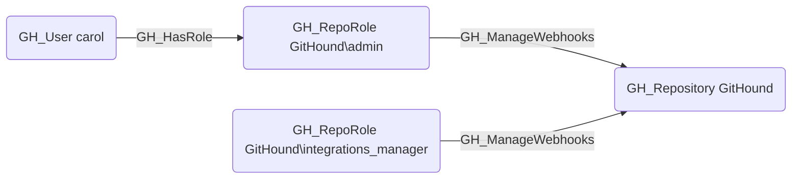

# GH_ManageWebhooks

## Edge Schema

- Source: [GH_RepoRole](../NodeDescriptions/GH_RepoRole.md)
- Destination: [GH_Repository](../NodeDescriptions/GH_Repository.md)

## General Information

The non-traversable [GH_ManageWebhooks](GH_ManageWebhooks.md) edge represents a role's ability to create, modify, and delete repository-level webhooks. This permission is available to Admin roles and custom roles that have been granted this specific permission. Webhooks can exfiltrate repository events and code changes to external endpoints, making this a security-sensitive permission. An attacker with this permission could configure a webhook to receive push event payloads containing commit diffs, effectively creating a covert channel for data exfiltration.

