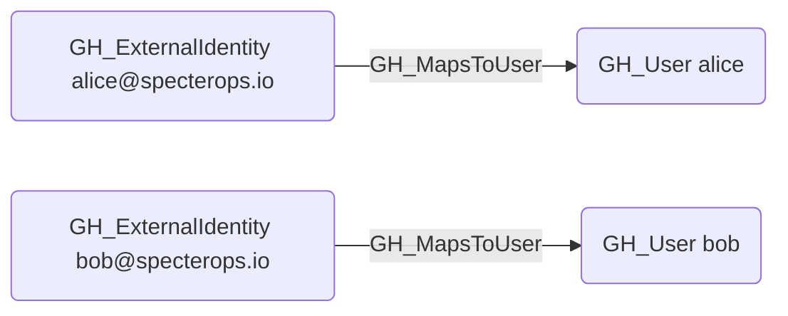

# GH_MapsToUser

## Edge Schema

- Source: [GH_ExternalIdentity](../NodeDescriptions/GH_ExternalIdentity.md)
- Destination: [GH_User](../NodeDescriptions/GH_User.md)

## General Information

The non-traversable [GH_MapsToUser](GH_MapsToUser.md) edge maps a GitHub external identity to either a GitHub user within the organization or enterprise, or to an external IdP user (such as [AZUser](https://bloodhound.specterops.io/resources/nodes/az-user), [Okta_User](https://bloodhound.specterops.io/opengraph/extensions/oktahound/reference/nodes/okta_user), or [PingOneUser](https://github.com/andyrobbins/PingOneHound?tab=readme-ov-file#schema)) in hybrid graph scenarios. It is created by `Git-HoundGraphQlSamlProvider` and `Git-HoundEnterpriseSamlProvider`. SCIM user records correlate to `GH_ExternalIdentity` via `SCIM_Provisioned`, not `GH_MapsToUser`. This edge represents identity correlation rather than an attack path, connecting a user's external IdP account to their GitHub account for visibility into federated identity mappings.

