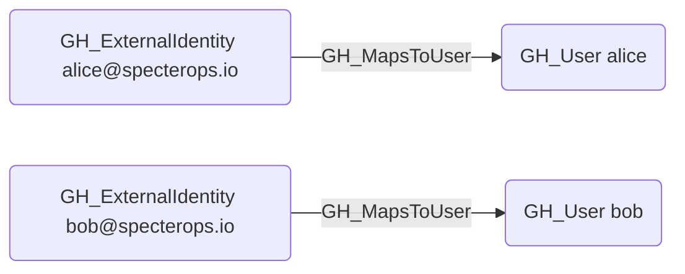

# GH_MapsToUser

## Edge Schema

- Source: [GH_ExternalIdentity](../NodeDescriptions/GH_ExternalIdentity.md), [GH_EnterpriseManagedUser](../NodeDescriptions/GH_EnterpriseManagedUser.md)
- Destination: [GH_User](../NodeDescriptions/GH_User.md)

## General Information

The non-traversable [GH_MapsToUser](GH_MapsToUser.md) edge maps a GitHub-side identity wrapper to the corresponding GitHub user, or maps a GitHub external identity to an external IdP user in hybrid graph scenarios. In GitHound today, that includes:

- `GH_ExternalIdentity -> GH_User`
- `GH_ExternalIdentity -> AZUser | Okta_User | PingOneUser`
- `GH_EnterpriseManagedUser -> GH_User`

It is created by `Git-HoundGraphQlSamlProvider`, `Git-HoundEnterpriseSamlProvider`, and `Git-HoundEnterpriseUser`. SCIM user records correlate to `GH_ExternalIdentity` via `SCIM_Provisioned`, not `GH_MapsToUser`. This edge represents identity correlation rather than an attack path, connecting a wrapper identity object to the GitHub principal it represents.

