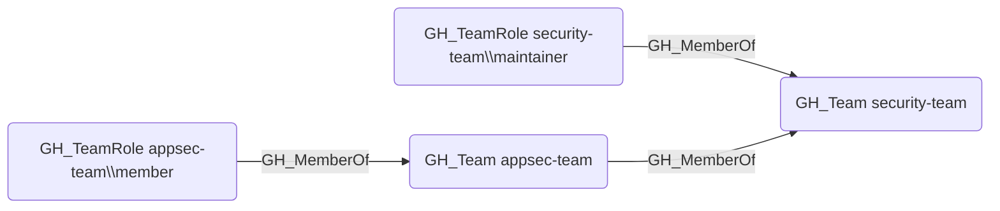

# GH_MemberOf

## Edge Schema

- Source: [GH_TeamRole](../Nodes/GH_TeamRole.md), [GH_Team](../Nodes/GH_Team.md)
- Destination: [GH_Team](../Nodes/GH_Team.md)

## General Information

The traversable `GH_MemberOf` edge represents team membership, linking a team role to its parent team or a child team to a parent team in nested team hierarchies. It is created by `Git-HoundTeam` during team enumeration. This edge is traversable because team membership extends access transitively -- a user who holds a role in a child team inherits the repository permissions of all ancestor teams in the nesting hierarchy, making it a key component of attack path analysis.

