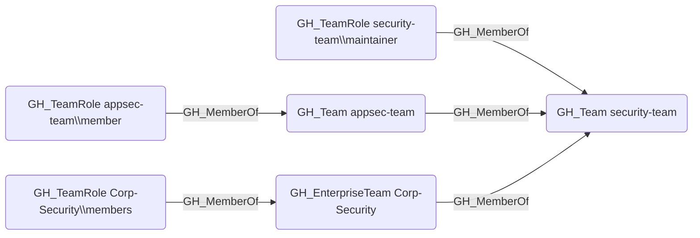

# GH_MemberOf

## Edge Schema

- Source: [GH_TeamRole](../NodeDescriptions/GH_TeamRole.md), [GH_Team](../NodeDescriptions/GH_Team.md), [GH_EnterpriseTeam](../NodeDescriptions/GH_EnterpriseTeam.md)
- Destination: [GH_Team](../NodeDescriptions/GH_Team.md), [GH_EnterpriseTeam](../NodeDescriptions/GH_EnterpriseTeam.md)

## General Information

The traversable [GH_MemberOf](GH_MemberOf.md) edge represents team membership, linking a team role to its parent team or a child team to a parent team in nested team hierarchies. At the organization level, it is created by `Git-HoundTeam` during team enumeration. At the enterprise level, it connects enterprise team roles to their enterprise team and enterprise teams to their corresponding organization-level teams. This edge is traversable because team membership extends access transitively -- a user who holds a role in a child team or enterprise team inherits the repository permissions of all ancestor teams in the hierarchy, making it a key component of attack path analysis.

