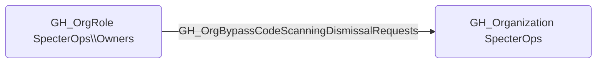

# GH_OrgBypassCodeScanningDismissalRequests

## Edge Schema

- Source: [GH_OrgRole](../NodeDescriptions/GH_OrgRole.md)
- Destination: [GH_Organization](../NodeDescriptions/GH_Organization.md)

## General Information

The non-traversable [GH_OrgBypassCodeScanningDismissalRequests](GH_OrgBypassCodeScanningDismissalRequests.md) edge represents that a role can bypass code scanning dismissal requests at the organization level. This edge is dynamically generated from custom organization role permissions discovered by the collector. This permission allows suppressing code scanning security findings without the standard review process, which is significant because an attacker could use it to hide vulnerabilities or malicious code patterns that would otherwise be flagged by automated scanning tools.

