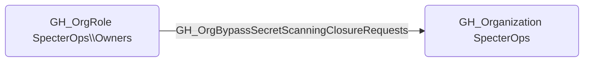

# GH_OrgBypassSecretScanningClosureRequests

## Edge Schema

- Source: [GH_OrgRole](../NodeDescriptions/GH_OrgRole.md)
- Destination: [GH_Organization](../NodeDescriptions/GH_Organization.md)

## General Information

The non-traversable [GH_OrgBypassSecretScanningClosureRequests](GH_OrgBypassSecretScanningClosureRequests.md) edge represents that a role can bypass secret scanning closure requests at the organization level. This edge is dynamically generated from custom organization role permissions discovered by the collector. This permission allows closing secret scanning alerts without going through the standard review and approval process, which is significant because an attacker could use it to suppress alerts about leaked credentials and prevent incident response teams from being notified.

