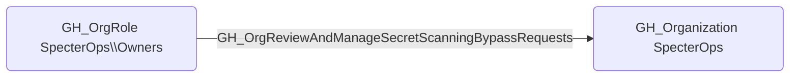

# GH_OrgReviewAndManageSecretScanningBypassRequests

## Edge Schema

- Source: [GH_OrgRole](../Nodes/GH_OrgRole.md)
- Destination: [GH_Organization](../Nodes/GH_Organization.md)

## General Information

The non-traversable `GH_OrgReviewAndManageSecretScanningBypassRequests` edge represents that a role can review and manage secret scanning push protection bypass requests at the organization level. This edge is dynamically generated from custom organization role permissions discovered by the collector. Push protection prevents secrets from being committed to repositories, and bypass requests allow developers to override this protection for specific commits. An attacker with this permission could approve their own or an accomplice's bypass requests, allowing secrets to be committed to repositories without triggering push protection blocks.

