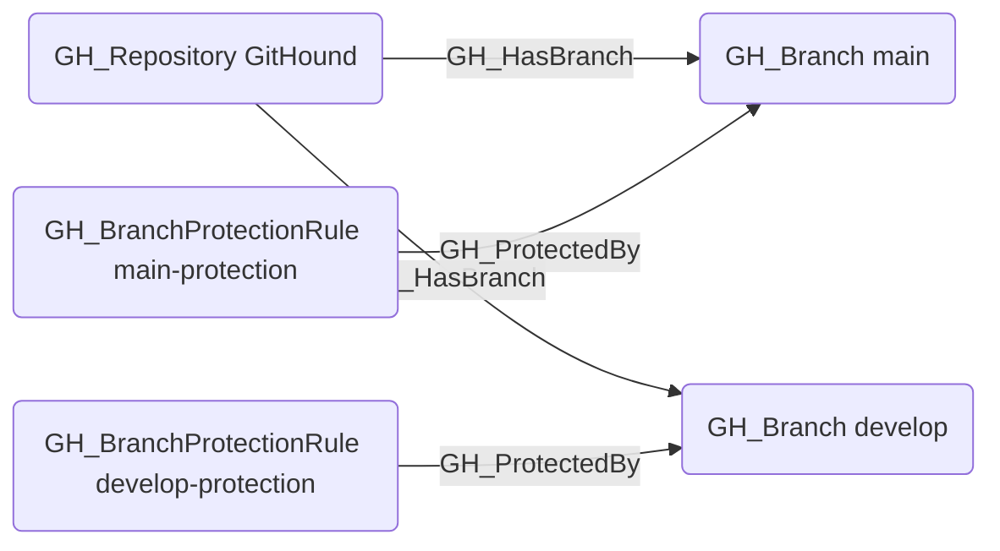

# GH_ProtectedBy

## Edge Schema

- Source: [GH_BranchProtectionRule](../Nodes/GH_BranchProtectionRule.md)
- Destination: [GH_Branch](../Nodes/GH_Branch.md)

## General Information

The traversable `GH_ProtectedBy` edge represents that a branch protection rule applies to a specific branch. Created by `Git-HoundBranch` when branch protection rules are collected, this edge links protection rules to the branches they govern. It is traversable because understanding which protections apply to a branch is critical for determining the effective access model -- protections such as required reviews, status checks, and push restrictions directly impact who can modify a branch. This edge is essential for attack path analysis because it reveals whether a branch has safeguards that must be bypassed to push malicious code or merge unauthorized changes.

