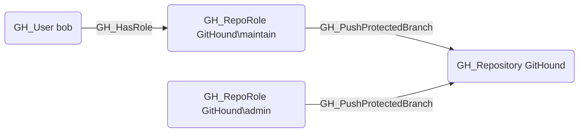

# GH_PushProtectedBranch

## Edge Schema

- Source: [GH_RepoRole](../Nodes/GH_RepoRole.md)
- Destination: [GH_Repository](../Nodes/GH_Repository.md)

## General Information

The non-traversable `GH_PushProtectedBranch` edge represents a role's ability to push directly to branches that are protected by push restrictions. This permission is available to Admin and Maintain roles. This edge bypasses the push gate of branch protection, allowing direct commits to protected branches without going through the pull request workflow. Unlike merge gate bypasses (such as `GH_BypassBranchProtection`), this push gate bypass is NOT suppressed by the `enforce_admins` setting on the branch protection rule, making it a particularly potent permission.

