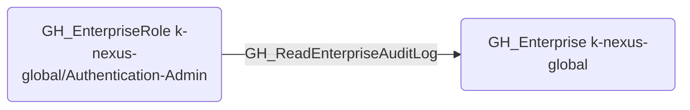

# GH_ReadEnterpriseAuditLog

## Edge Schema

- Source: [GH_EnterpriseRole](../NodeDescriptions/GH_EnterpriseRole.md)
- Destination: [GH_Enterprise](../NodeDescriptions/GH_Enterprise.md)

## General Information

The non-traversable [GH_ReadEnterpriseAuditLog](GH_ReadEnterpriseAuditLog.md) edge represents that a custom enterprise role can read the enterprise audit log. This edge is dynamically generated from custom enterprise role permissions discovered by the collector. Audit log access provides visibility into all actions taken across the enterprise, which could be used for reconnaissance or to monitor defensive responses.

