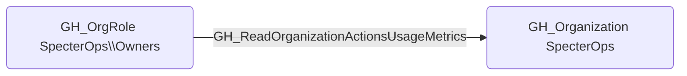

# GH_ReadOrganizationActionsUsageMetrics

## Edge Schema

- Source: [GH_OrgRole](../NodeDescriptions/GH_OrgRole.md)
- Destination: [GH_Organization](../NodeDescriptions/GH_Organization.md)

## General Information

The non-traversable [GH_ReadOrganizationActionsUsageMetrics](GH_ReadOrganizationActionsUsageMetrics.md) edge represents that a role can read GitHub Actions usage metrics for the organization. This edge is dynamically generated from custom organization role permissions discovered by the collector. Usage metrics provide visibility into workflow execution patterns, runner utilization, and billing data across the organization. While this is primarily an informational permission, it can reveal which repositories have active CI/CD pipelines and the scale of automation in use.

