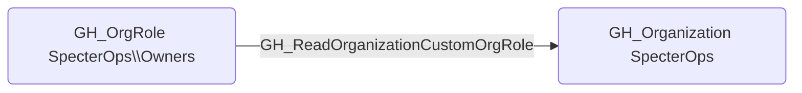

# GH_ReadOrganizationCustomOrgRole

## Edge Schema

- Source: [GH_OrgRole](../Nodes/GH_OrgRole.md)
- Destination: [GH_Organization](../Nodes/GH_Organization.md)

## General Information

The non-traversable `GH_ReadOrganizationCustomOrgRole` edge represents that a role can read custom organization role definitions. This edge is dynamically generated from custom organization role permissions discovered by the collector. Reading custom org role definitions allows a user to enumerate the permissions granted to each custom role, which provides reconnaissance value for understanding the organization's access control model and identifying roles with elevated privileges.

