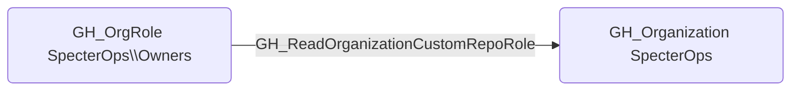

# GH_ReadOrganizationCustomRepoRole

## Edge Schema

- Source: [GH_OrgRole](../NodeDescriptions/GH_OrgRole.md)
- Destination: [GH_Organization](../NodeDescriptions/GH_Organization.md)

## General Information

The non-traversable [GH_ReadOrganizationCustomRepoRole](GH_ReadOrganizationCustomRepoRole.md) edge represents that a role can read custom repository role definitions. This edge is dynamically generated from custom organization role permissions discovered by the collector. Reading custom repo role definitions allows a user to enumerate the permissions granted to each custom repository role, which provides reconnaissance value for understanding repository-level access controls and identifying roles that grant elevated repository permissions.

