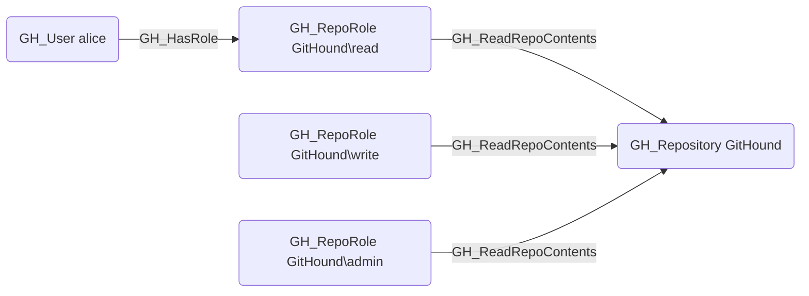

# GH_ReadRepoContents

## Edge Schema

- Source: [GH_RepoRole](../Nodes/GH_RepoRole.md)
- Destination: [GH_Repository](../Nodes/GH_Repository.md)

## General Information

The traversable `GH_ReadRepoContents` edge represents a role's ability to read repository contents including source code, issues, and pull requests. This is the base level of repository access, available to all roles at the Read permission level and above (Read, Triage, Write, Maintain, Admin). It is traversable because read access is the entry point to the repository and the foundation from which all other repository interactions are built. Without this edge, a principal has no visibility into the repository's contents.

