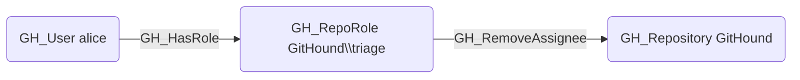

# GH_RemoveAssignee

## Edge Schema

- Source: [GH_RepoRole](../NodeDescriptions/GH_RepoRole.md)
- Destination: [GH_Repository](../NodeDescriptions/GH_Repository.md)

## General Information

The non-traversable [GH_RemoveAssignee](GH_RemoveAssignee.md) edge represents a role's ability to remove assignees from issues and pull requests. This permission is available to Triage, Write, Maintain, and Admin roles and custom roles that have been granted this specific permission.

