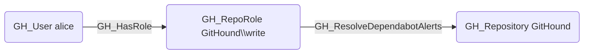

# GH_ResolveDependabotAlerts

## Edge Schema

- Source: [GH_RepoRole](../Nodes/GH_RepoRole.md)
- Destination: [GH_Repository](../Nodes/GH_Repository.md)

## General Information

The non-traversable `GH_ResolveDependabotAlerts` edge represents a role's ability to dismiss or resolve Dependabot alerts. This permission is available to Write, Maintain, and Admin roles and custom roles that have been granted this specific permission. An attacker could dismiss valid alerts to suppress vulnerability warnings and prevent remediation.

