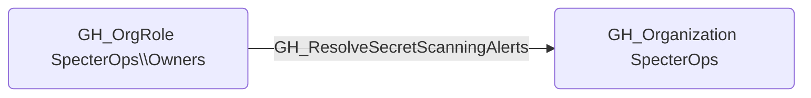

# GH_ResolveSecretScanningAlerts

## Edge Schema

- Source: [GH_OrgRole](../NodeDescriptions/GH_OrgRole.md)
- Destination: [GH_Organization](../NodeDescriptions/GH_Organization.md)

## General Information

The non-traversable [GH_ResolveSecretScanningAlerts](GH_ResolveSecretScanningAlerts.md) edge represents that a role can resolve (close) secret scanning alerts at the organization level. This edge is dynamically generated from custom organization role permissions discovered by the collector. Resolving a secret scanning alert marks a leaked secret as addressed, which removes it from active monitoring dashboards. An attacker with this permission could suppress alerts about leaked credentials to prevent incident response teams from detecting and rotating compromised secrets.

