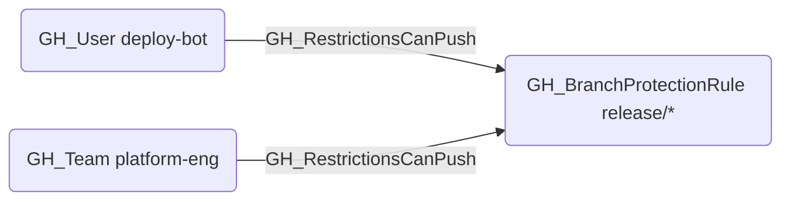

# GH_RestrictionsCanPush

## Edge Schema

- Source: [GH_User](../NodeDescriptions/GH_User.md), [GH_Team](../NodeDescriptions/GH_Team.md)
- Destination: [GH_BranchProtectionRule](../NodeDescriptions/GH_BranchProtectionRule.md)

## General Information

The non-traversable [GH_RestrictionsCanPush](GH_RestrictionsCanPush.md) edge represents a per-actor allowance that grants push access through push restrictions on a branch protection rule. Created by `Git-HoundBranch` when collecting BPR push allowances, this edge identifies specific users or teams that are permitted to push to the protected branch even when push restrictions are active. This is security-relevant because push restrictions limit who can directly push to a branch, and actors with this allowance bypass that control. Unlike [GH_BypassPullRequestAllowances](GH_BypassPullRequestAllowances.md), this allowance is NOT suppressed by `enforce_admins` — listed actors retain push access regardless of admin enforcement settings.

