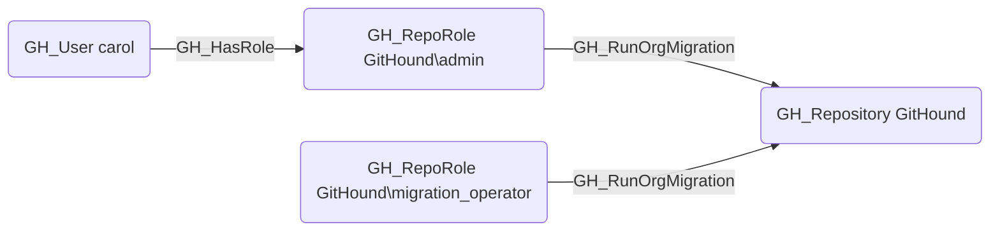

# GH_RunOrgMigration

## Edge Schema

- Source: [GH_RepoRole](../NodeDescriptions/GH_RepoRole.md)
- Destination: [GH_Repository](../NodeDescriptions/GH_Repository.md)

## General Information

The non-traversable [GH_RunOrgMigration](GH_RunOrgMigration.md) edge represents a role's ability to run organization migrations on the repository. This permission is available to Admin roles and custom roles that have been granted this specific permission. Organization migrations export repository data including source code, issues, and pull requests, which can be used to transfer repository contents to another organization. This permission is security-relevant because it enables bulk data export from the repository.

