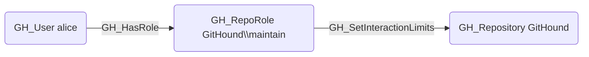

# GH_SetInteractionLimits

## Edge Schema

- Source: [GH_RepoRole](../NodeDescriptions/GH_RepoRole.md)
- Destination: [GH_Repository](../NodeDescriptions/GH_Repository.md)

## General Information

The non-traversable [GH_SetInteractionLimits](GH_SetInteractionLimits.md) edge represents a role's ability to set temporary interaction limits to restrict who can comment, open issues, or create pull requests. This permission is available to Maintain and Admin roles and custom roles that have been granted this specific permission.

