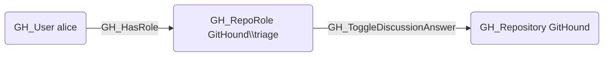

# GH_ToggleDiscussionAnswer

## Edge Schema

- Source: [GH_RepoRole](../Nodes/GH_RepoRole.md)
- Destination: [GH_Repository](../Nodes/GH_Repository.md)

## General Information

The non-traversable `GH_ToggleDiscussionAnswer` edge represents a role's ability to mark or unmark a discussion comment as the accepted answer. This permission is available to Triage, Write, Maintain, and Admin roles and custom roles that have been granted this specific permission.

