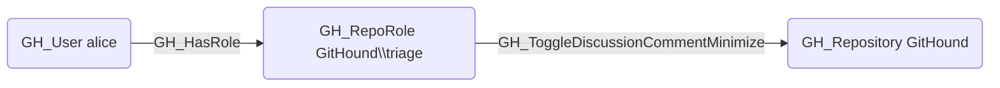

# GH_ToggleDiscussionCommentMinimize

## Edge Schema

- Source: [GH_RepoRole](../NodeDescriptions/GH_RepoRole.md)
- Destination: [GH_Repository](../NodeDescriptions/GH_Repository.md)

## General Information

The non-traversable [GH_ToggleDiscussionCommentMinimize](GH_ToggleDiscussionCommentMinimize.md) edge represents a role's ability to minimize or restore discussion comments, hiding them from default view. This permission is available to Triage, Write, Maintain, and Admin roles and custom roles that have been granted this specific permission.

