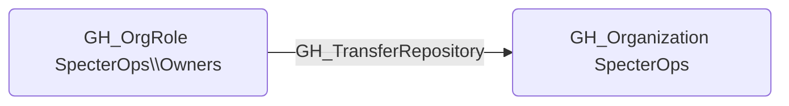

# GH_TransferRepository

## Edge Schema

- Source: [GH_OrgRole](../Nodes/GH_OrgRole.md)
- Destination: [GH_Organization](../Nodes/GH_Organization.md)

## General Information

The non-traversable `GH_TransferRepository` edge represents that a role has the ability to transfer repositories to or from the organization. This permission is typically restricted to Owners, as transferring a repository can move it outside of the organization's security controls, branch protection rules, and audit logging. An attacker with this permission could transfer a repository to an organization they control, effectively exfiltrating the codebase and its associated secrets.

