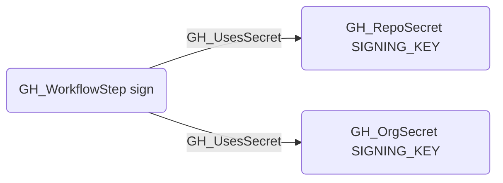

# GH_UsesSecret

## Edge Schema

- Source: [GH_WorkflowStep](../NodeDescriptions/GH_WorkflowStep.md)
- Destination: [GH_RepoSecret](../NodeDescriptions/GH_RepoSecret.md) or [GH_OrgSecret](../NodeDescriptions/GH_OrgSecret.md)

## General Information

The traversable [GH_UsesSecret](GH_UsesSecret.md) edge links a workflow step to the secret it references via a `${{ secrets.NAME }}` expression. Created during the integrated workflow-analysis step in `Invoke-GitHound`, this edge reveals which secrets a step can access at runtime, enabling analysts to trace the blast radius of a compromised workflow.

### Matching strategy

Edges use `match_by: property` with two matchers to disambiguate between secrets with the same name across repositories:

- **GH_RepoSecret** is matched by `name` + `repository_id` (the GitHub node_id of the repository).
- **GH_OrgSecret** is matched by `name` + `environmentid` (the node_id of the organization, which acts as the org-level secret scope).

This means one `${{ secrets.MY_SECRET }}` expression in a workflow can produce up to two `GH_UsesSecret` edges — one to the repo-level secret and one to the org-level secret — reflecting that either could supply the value at runtime depending on scope precedence.

### Context property

The edge carries a `context` property indicating where the reference was found:
- `with` — inside a `with:` input block of a `uses:` action step
- `env` — inside the step's `env:` block
- `run` — inline within a `run:` shell script

