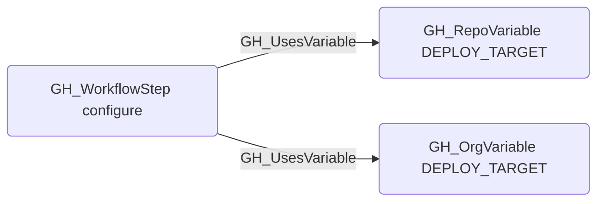

# GH_UsesVariable

## Edge Schema

- Source: [GH_WorkflowStep](../NodeDescriptions/GH_WorkflowStep.md)
- Destination: [GH_RepoVariable](../NodeDescriptions/GH_RepoVariable.md) or [GH_OrgVariable](../NodeDescriptions/GH_OrgVariable.md)

## General Information

The non-traversable [GH_UsesVariable](GH_UsesVariable.md) edge links a workflow step to the variable it references via a `${{ vars.NAME }}` expression. Created during the integrated workflow-analysis step in `Invoke-GitHound`, this edge maps variable consumption within workflows. Unlike secrets, variable values are readable via the API, making them lower sensitivity, but they can still influence workflow behavior such as controlling target environments or feature flags.

### Matching strategy

Edges use `match_by: property` with two matchers to disambiguate between variables with the same name across repositories:

- **GH_RepoVariable** is matched by `name` + `repository_id` (the GitHub node_id of the repository).
- **GH_OrgVariable** is matched by `name` + `environmentid` (the node_id of the organization, which acts as the org-level variable scope).

This means one `${{ vars.MY_VAR }}` expression can produce up to two `GH_UsesVariable` edges — one to the repo-level variable and one to the org-level variable.

### Context property

The edge carries a `context` property indicating where the reference was found:
- `with` — inside a `with:` input block of a `uses:` action step
- `env` — inside the step's `env:` block
- `run` — inline within a `run:` shell script

