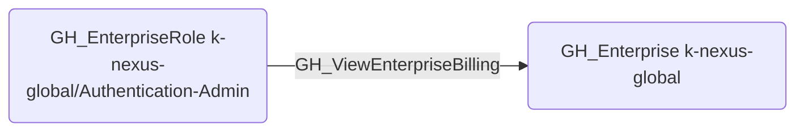

# GH_ViewEnterpriseBilling

## Edge Schema

- Source: [GH_EnterpriseRole](../NodeDescriptions/GH_EnterpriseRole.md)
- Destination: [GH_Enterprise](../NodeDescriptions/GH_Enterprise.md)

## General Information

The non-traversable [GH_ViewEnterpriseBilling](GH_ViewEnterpriseBilling.md) edge represents that a custom enterprise role can view enterprise billing information. This edge is dynamically generated from custom enterprise role permissions discovered by the collector.

