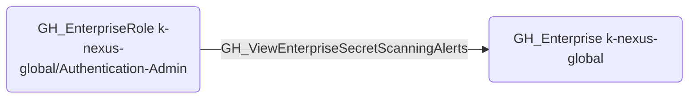

# GH_ViewEnterpriseSecretScanningAlerts

## Edge Schema

- Source: [GH_EnterpriseRole](../NodeDescriptions/GH_EnterpriseRole.md)
- Destination: [GH_Enterprise](../NodeDescriptions/GH_Enterprise.md)

## General Information

The non-traversable [GH_ViewEnterpriseSecretScanningAlerts](GH_ViewEnterpriseSecretScanningAlerts.md) edge represents that a custom enterprise role can view secret scanning alerts across the enterprise. This edge is dynamically generated from custom enterprise role permissions discovered by the collector. Access to secret scanning alerts reveals exposed credentials and tokens across all enterprise repositories.

