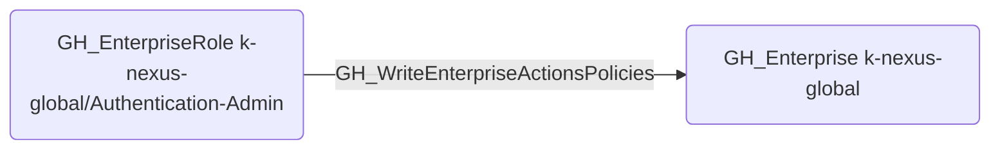

# GH_WriteEnterpriseActionsPolicies

## Edge Schema

- Source: [GH_EnterpriseRole](../NodeDescriptions/GH_EnterpriseRole.md)
- Destination: [GH_Enterprise](../NodeDescriptions/GH_Enterprise.md)

## General Information

The non-traversable [GH_WriteEnterpriseActionsPolicies](GH_WriteEnterpriseActionsPolicies.md) edge represents that a custom enterprise role can modify GitHub Actions policies for the enterprise. This edge is dynamically generated from custom enterprise role permissions discovered by the collector. Actions policies control which actions and reusable workflows are allowed across the enterprise, so modifying them could enable execution of malicious third-party actions.

