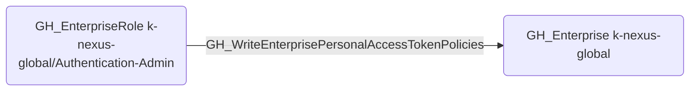

# GH_WriteEnterprisePersonalAccessTokenPolicies

## Edge Schema

- Source: [GH_EnterpriseRole](../NodeDescriptions/GH_EnterpriseRole.md)
- Destination: [GH_Enterprise](../NodeDescriptions/GH_Enterprise.md)

## General Information

The non-traversable [GH_WriteEnterprisePersonalAccessTokenPolicies](GH_WriteEnterprisePersonalAccessTokenPolicies.md) edge represents that a custom enterprise role can modify personal access token policies for the enterprise. This edge is dynamically generated from custom enterprise role permissions discovered by the collector. PAT policies control which token types are allowed, their maximum lifetime, and approval requirements -- weakening these controls could enable persistence via long-lived or unrestricted tokens.

