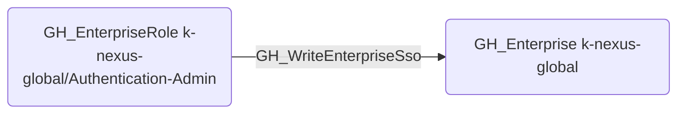

# GH_WriteEnterpriseSso

## Edge Schema

- Source: [GH_EnterpriseRole](../NodeDescriptions/GH_EnterpriseRole.md)
- Destination: [GH_Enterprise](../NodeDescriptions/GH_Enterprise.md)

## General Information

The non-traversable [GH_WriteEnterpriseSso](GH_WriteEnterpriseSso.md) edge represents that a custom enterprise role can modify enterprise SSO settings. This edge is dynamically generated from custom enterprise role permissions discovered by the collector. SSO settings control SAML and SCIM configurations -- modifying them could disrupt authentication, bypass SSO enforcement, or redirect authentication flows to an attacker-controlled identity provider.

