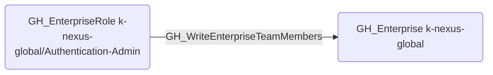

# GH_WriteEnterpriseTeamMembers

## Edge Schema

- Source: [GH_EnterpriseRole](../NodeDescriptions/GH_EnterpriseRole.md)
- Destination: [GH_Enterprise](../NodeDescriptions/GH_Enterprise.md)

## General Information

The non-traversable [GH_WriteEnterpriseTeamMembers](GH_WriteEnterpriseTeamMembers.md) edge represents that a custom enterprise role can modify enterprise team membership. This edge is dynamically generated from custom enterprise role permissions discovered by the collector. Enterprise teams can be mapped to organization-level teams and assigned to custom enterprise roles, so modifying membership could grant indirect access to organization resources or enterprise-level permissions.

