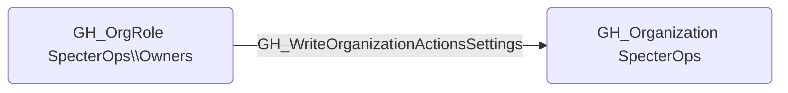

# GH_WriteOrganizationActionsSettings

## Edge Schema

- Source: [GH_OrgRole](../Nodes/GH_OrgRole.md)
- Destination: [GH_Organization](../Nodes/GH_Organization.md)

## General Information

The non-traversable `GH_WriteOrganizationActionsSettings` edge represents that a role can modify organization-level GitHub Actions settings. This edge is dynamically generated from custom organization role permissions discovered by the collector. These settings control which actions are allowed to run within the organization and the default permissions granted to the `GITHUB_TOKEN` in workflows. An attacker with this permission could weaken restrictions to allow untrusted third-party actions or elevate default token permissions to enable write access across repositories.

