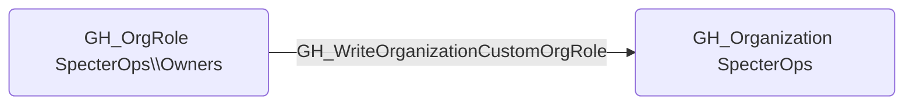

# GH_WriteOrganizationCustomOrgRole

## Edge Schema

- Source: [GH_OrgRole](../Nodes/GH_OrgRole.md)
- Destination: [GH_Organization](../Nodes/GH_Organization.md)

## General Information

The non-traversable `GH_WriteOrganizationCustomOrgRole` edge represents that a role can create or modify custom organization role definitions. This edge is dynamically generated from custom organization role permissions discovered by the collector. Modifying organization role definitions can escalate privileges because an attacker could add permissions to an existing custom role that is already assigned to their account, or create a new role with elevated permissions. This makes it a high-impact permission for privilege escalation within the organization.

