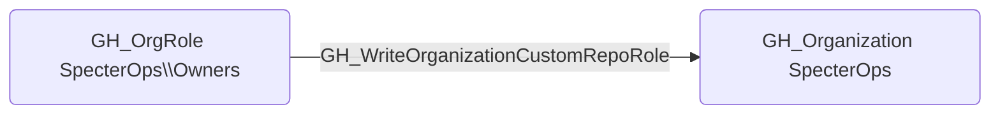

# GH_WriteOrganizationCustomRepoRole

## Edge Schema

- Source: [GH_OrgRole](../Nodes/GH_OrgRole.md)
- Destination: [GH_Organization](../Nodes/GH_Organization.md)

## General Information

The non-traversable `GH_WriteOrganizationCustomRepoRole` edge represents that a role can create or modify custom repository role definitions. This edge is dynamically generated from custom organization role permissions discovered by the collector. Modifying repository role definitions can escalate privileges because an attacker could add permissions such as admin access, bypass branch protections, or secret management to a custom repo role that is already assigned to their account. This makes it a high-impact permission for gaining elevated access to repositories across the organization.

