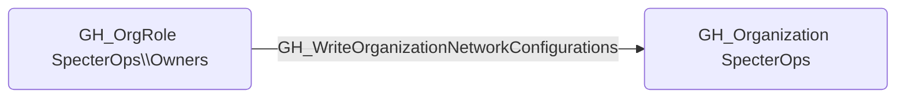

# GH_WriteOrganizationNetworkConfigurations

## Edge Schema

- Source: [GH_OrgRole](../Nodes/GH_OrgRole.md)
- Destination: [GH_Organization](../Nodes/GH_Organization.md)

## General Information

The non-traversable `GH_WriteOrganizationNetworkConfigurations` edge represents that a role can modify organization network configurations. This edge is dynamically generated from custom organization role permissions discovered by the collector. Network configurations control how GitHub-hosted runners connect to private resources such as internal APIs, databases, and cloud services. An attacker with this permission could modify network settings to route runner traffic through attacker-controlled infrastructure or grant runners access to previously isolated network segments.

