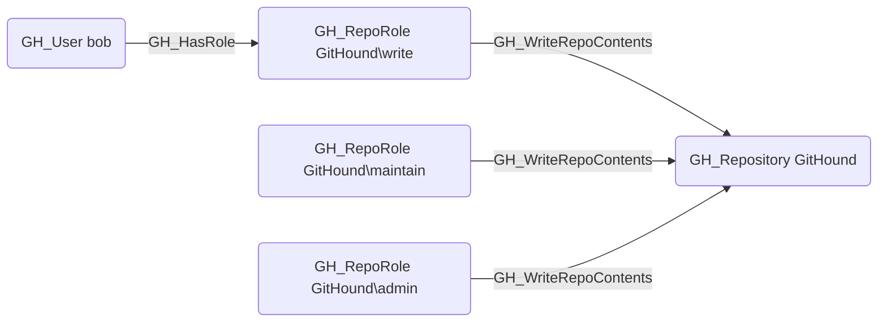

# GH_WriteRepoContents

## Edge Schema

- Source: [GH_RepoRole](../Nodes/GH_RepoRole.md)
- Destination: [GH_Repository](../Nodes/GH_Repository.md)

## General Information

The non-traversable `GH_WriteRepoContents` edge represents a role's ability to push commits to the repository. This permission is available to Write, Maintain, and Admin roles. Pushing code can modify application behavior and introduce vulnerabilities, making this a security-significant edge. However, this edge represents only the raw permission; actual branch push capability is determined by the computed `GH_CanWriteBranch` edge, which factors in branch protection rules and push restrictions.

