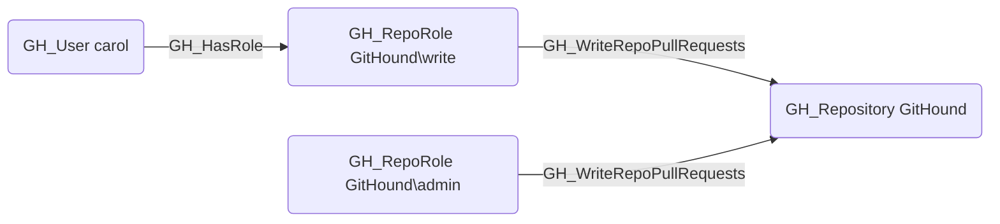

# GH_WriteRepoPullRequests

## Edge Schema

- Source: [GH_RepoRole](../NodeDescriptions/GH_RepoRole.md)
- Destination: [GH_Repository](../NodeDescriptions/GH_Repository.md)

## General Information

The non-traversable [GH_WriteRepoPullRequests](GH_WriteRepoPullRequests.md) edge represents a role's ability to create and merge pull requests in the repository. This permission is available to Write, Maintain, and Admin roles. Pull request merge access is security-significant because merging code into protected branches is a common vector for introducing unauthorized changes; however, actual merge capability on protected branches is further governed by branch protection rules and required reviews.

