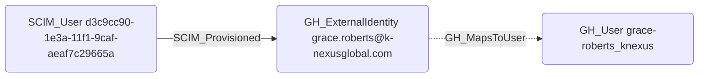

# SCIM_Provisioned

## Edge Schema

- Source: `SCIM_User`
- Destination: [GH_ExternalIdentity](../NodeDescriptions/GH_ExternalIdentity.md)

## General Information

The traversable `SCIM_Provisioned` edge correlates a SCIM-provisioned user record to the matching GitHub external identity. In GitHound, this edge is created by `Git-HoundScimUser` and `Git-HoundEnterpriseScimUser` when a SCIM user can be matched to a `GH_ExternalIdentity` using both the SCIM resource identifier and the SCIM username.

This edge is intentionally stronger than a loose name-only match. The current correlation uses:

- `SCIM_User.id`
- `GH_ExternalIdentity.guid`
- `SCIM_User.userName`
- `GH_ExternalIdentity.scim_identity_username`

That gives us a reliable bridge from the raw SCIM layer into GitHub's native external identity object without skipping straight to `GH_User`.

