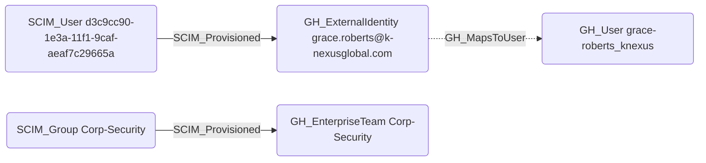

# SCIM_Provisioned

## Edge Schema

- Source: `SCIM_User`, `SCIM_Group`
- Destination: [GH_ExternalIdentity](../NodeDescriptions/GH_ExternalIdentity.md), [GH_EnterpriseTeam](../NodeDescriptions/GH_EnterpriseTeam.md)

## General Information

The traversable `SCIM_Provisioned` edge correlates SCIM-provisioned objects to the GitHub object they provision or represent. In GitHound today, that means:

- `SCIM_User -> GH_ExternalIdentity`
- `SCIM_Group -> GH_EnterpriseTeam`

The user correlation is created by `Git-HoundScimUser` and `Git-HoundEnterpriseScimUser`. The group-to-team correlation is created by `Git-HoundEnterpriseScimGroup` when GitHub exposes a `group_id` on the matching enterprise team.

For SCIM users, the correlation is intentionally stronger than a loose name-only match. The current correlation uses:

- `SCIM_User.id`
- `GH_ExternalIdentity.guid`
- `SCIM_User.userName`
- `GH_ExternalIdentity.scim_identity_username`

That gives us a reliable bridge from the raw SCIM layer into GitHub's native external identity object without skipping straight to `GH_User`.

For SCIM groups, the current enterprise correlation uses:

- `SCIM_Group.id`
- `GH_EnterpriseTeam.group_id`
- shared `environmentid`

That ties the generic SCIM group model into GitHub's enterprise team model using GitHub-native data rather than provider-specific guessing.

