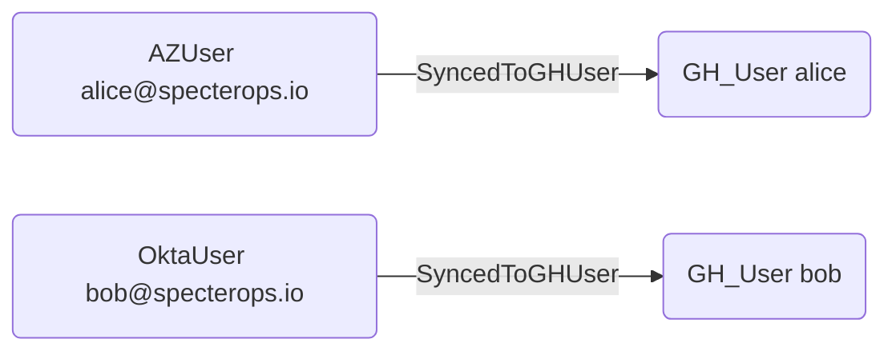

# SyncedToGHUser

## Edge Schema

- Source: [AZUser](https://bloodhound.specterops.io/resources/nodes/az-user), [OktaUser](https://github.com/SpecterOps/OktaHound), [PingOneUser](https://github.com/SpecterOps/PingHound)
- Destination: [GH_User](../Nodes/GH_User.md)

## General Information

The traversable `SyncedToGHUser` edge is a hybrid edge that maps an external IdP user to a GitHub user based on SCIM provisioning. Created by `Git-HoundScimUser` when SCIM data links an external identity to a GitHub account, this edge represents a confirmed identity linkage between an external identity provider and GitHub. It is traversable because compromising the IdP account provides a verified path to the corresponding GitHub account, making it a critical edge for cross-system attack path analysis. This edge enables analysts to trace access from enterprise identity providers like Azure AD, Okta, or PingOne into the GitHub environment.

