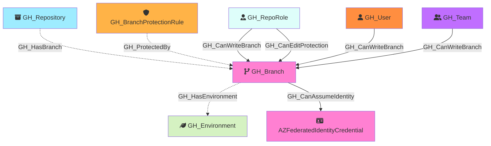

#  GH_Branch

Represents a Git branch within a repository. Branch nodes capture basic branch information and whether the branch is protected. Protection rule details are stored in separate [GH_BranchProtectionRule](GH_BranchProtectionRule.md) nodes, linked via [GH_ProtectedBy](../EdgeDescriptions/GH_ProtectedBy.md) edges.

Created by: `Git-HoundBranch`

## Properties

| Property Name    | Data Type | Description                                                                    |
| ---------------- | --------- | ------------------------------------------------------------------------------ |
| objectid         | string    | A unique identifier for the branch: `REF_kwDOMuFnXLNyZWZzL2hlYWRzL0NhblB1c2gz` |
| name             | string    | The fully qualified branch name (e.g., `repo\main`).                           |
| short_name       | string    | The branch reference name (e.g., `main`).                                      |
| node_id          | string    | Same as objectid.                                                              |
| environment_name | string    | The name of the environment (GitHub organization).                             |
| environmentid    | string    | The node_id of the environment (GitHub organization).                          |
| protected        | boolean   | Whether the branch has a protection rule.                                      |

## Edges

### Outbound Edges

| Edge Kind                                                           | Target Node                                                                                                        | Traversable | Description                                                                                  |
| ------------------------------------------------------------------- | ------------------------------------------------------------------------------------------------------------------ | ----------- | -------------------------------------------------------------------------------------------- |
| [GH_HasEnvironment](../EdgeDescriptions/GH_HasEnvironment.md)       | [GH_Environment](GH_Environment.md)                                                                                | No          | Branch has a deployment environment via custom branch policy (from Git-HoundEnvironment).    |
| [GH_CanAssumeIdentity](../EdgeDescriptions/GH_CanAssumeIdentity.md) | [AZFederatedIdentityCredential](https://bloodhound.specterops.io/resources/nodes/az-federated-identity-credential) | Yes         | Branch can assume an Azure federated identity via OIDC (subject: `ref:refs/heads/{branch}`). |

### Inbound Edges

| Edge Kind                                                           | Source Node                                           | Traversable | Description                                                                        |
| ------------------------------------------------------------------- | ----------------------------------------------------- | ----------- | ---------------------------------------------------------------------------------- |
| [GH_HasBranch](../EdgeDescriptions/GH_HasBranch.md)                 | [GH_Repository](GH_Repository.md)                     | No          | Repository has this branch.                                                        |
| [GH_ProtectedBy](../EdgeDescriptions/GH_ProtectedBy.md)             | [GH_BranchProtectionRule](GH_BranchProtectionRule.md) | No          | Branch protection rule protects this branch.                                       |
| [GH_CanEditProtection](../EdgeDescriptions/GH_CanEditProtection.md) | [GH_RepoRole](GH_RepoRole.md)                         | Yes         | Repo role can modify/remove the protection rules governing this branch (computed). |
| [GH_CanWriteBranch](../EdgeDescriptions/GH_CanWriteBranch.md)       | [GH_RepoRole](GH_RepoRole.md)                         | Yes         | Repo role can push to this branch (computed from permissions + BPR state).         |
| [GH_CanWriteBranch](../EdgeDescriptions/GH_CanWriteBranch.md)       | [GH_User](GH_User.md) or [GH_Team](GH_Team.md)        | Yes         | User or team can push to this branch (computed — per-actor allowance delta).       |

## Diagram

