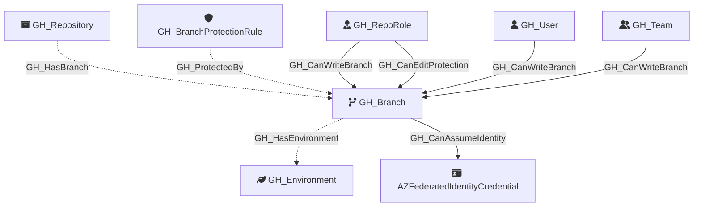

#  GH_Branch

Represents a Git branch within a repository. Branch nodes capture basic branch information and whether the branch is protected. Protection rule details are stored in separate [GH_BranchProtectionRule](GH_BranchProtectionRule.md) nodes, linked via [GH_ProtectedBy](../EdgeDescriptions/GH_ProtectedBy.md) edges.

Created by: `Git-HoundBranch`

## Properties

| Property Name    | Data Type | Description                                                                    |
| ---------------- | --------- | ------------------------------------------------------------------------------ |
| objectid         | string    | A unique identifier for the branch: `REF_kwDOMuFnXLNyZWZzL2hlYWRzL0NhblB1c2gz` |
| name             | string    | The fully qualified branch name (e.g., `repo\main`).                           |
| short_name       | string    | The branch reference name (e.g., `main`).                                      |
| node_id          | string    | Same as objectid.                                                              |
| environment_name | string    | The name of the environment (GitHub organization).                             |
| environmentid    | string    | The node_id of the environment (GitHub organization).                          |
| protected        | boolean   | Whether the branch has a protection rule.                                      |

## Diagram

