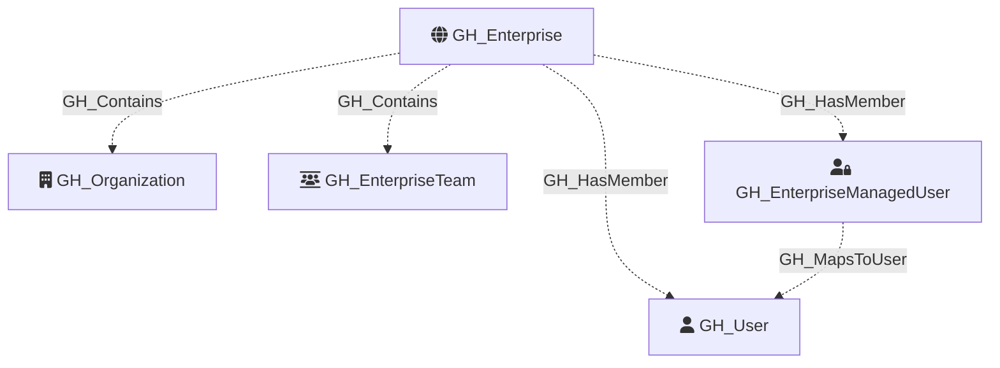

#  GH_Enterprise

Represents a GitHub Enterprise account. This is the structural parent of member organizations, enterprise teams, and the natural container for enterprise-wide settings, role relationships, and enterprise membership.

Created by: `Git-HoundEnterprise`

## Properties

| Property Name         | Data Type | Description                                                                                      |
| --------------------- | --------- | ------------------------------------------------------------------------------------------------ |
| objectid              | string    | The GitHub GraphQL node ID of the enterprise, used as the unique graph identifier.              |
| name                  | string    | The enterprise slug, used as the display name.                                                  |
| node_id               | string    | The GitHub GraphQL node ID. Redundant with objectid.                                            |
| collected             | boolean   | Marker property indicating that this enterprise node came from an actual GitHound collection.   |
| environmentid         | string    | The enterprise node ID, used as the environment identifier for enterprise-scoped data.          |
| environment_name      | string    | The enterprise slug, used as the environment name.                                              |
| slug                  | string    | The enterprise slug (URL component).                                                            |
| enterprise_name       | string    | The display name of the enterprise.                                                             |
| description           | string    | The enterprise description.                                                                     |
| location              | string    | The enterprise location.                                                                        |
| url                   | string    | The primary GitHub URL for the enterprise.                                                      |
| website_url           | string    | The enterprise website URL.                                                                     |
| created_at            | string    | When the enterprise was created.                                                                |
| updated_at            | string    | When the enterprise was last updated.                                                           |
| billing_email         | string    | The enterprise billing contact email, when available.                                           |
| security_contact_email| string    | The enterprise security contact email, when available.                                          |
| viewer_is_admin       | boolean   | Whether the authenticated principal is an enterprise admin.                                     |

Enterprise collection currently emits lightweight `GH_Organization` stub nodes for member organizations and links them with `GH_Contains`. Those organization nodes are intended to be enriched later by full organization collection. Enterprise user collection adds `GH_HasMember` edges from the enterprise to discovered `GH_User` nodes in traditional-account environments, and to `GH_EnterpriseManagedUser` nodes in enterprise-managed-user environments. Enterprise-managed users then map back to `GH_User` with `GH_MapsToUser`. Enterprise team collection adds `GH_EnterpriseTeam` nodes, links them with `GH_Contains`, and models organization assignment separately with `GH_AssignedTo`.

## Diagram

