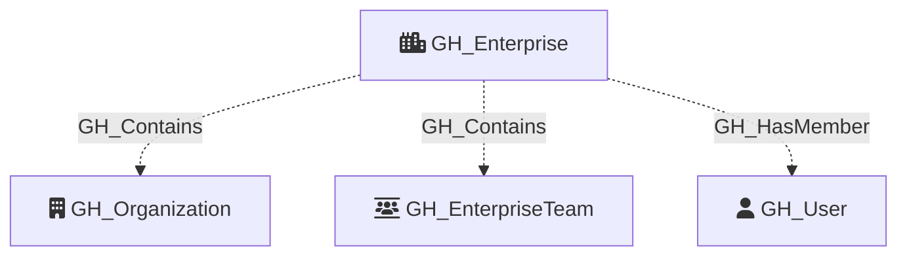

# GH_Enterprise

Represents a GitHub Enterprise account. This is the top-level node in an enterprise collection and serves as the parent container for organizations. Enterprise profile information and billing data are collected via GraphQL.

Note: `enterprise.ownerInfo` (which contains enterprise-level policy settings) is not accessible via GitHub App tokens. REST endpoints for Actions permissions and code security settings require enterprise-level app permissions that do not currently exist. These can be added in the future if GitHub expands the available enterprise app permissions.

Created by: `Git-HoundEnterprise`

## Properties

| Property Name                | Data Type | Description                                                          |
| ---------------------------- | --------- | -------------------------------------------------------------------- |
| objectid                     | string    | The enterprise's GraphQL node ID.                                    |
| name                         | string    | The display name of the enterprise.                                  |
| slug                         | string    | The enterprise's URL-friendly slug identifier.                       |
| database_id                  | integer   | The enterprise's numeric database ID.                                |
| description                  | string    | The enterprise's description.                                        |
| location                     | string    | The enterprise's location.                                           |
| url                          | string    | The HTTP URL for the enterprise.                                     |
| website_url                  | string    | The enterprise's website URL.                                        |
| created_at                   | datetime  | When the enterprise was created.                                     |
| updated_at                   | datetime  | When the enterprise was last updated.                                |
| billing_email                | string    | The enterprise's billing email address.                              |
| security_contact_email       | string    | The enterprise's security contact email address.                     |
| viewer_is_admin              | boolean   | Whether the authenticated token has admin access to the enterprise.  |
| all_licensable_users_count   | integer   | Total number of licensable users and emails.                         |
| total_licenses               | integer   | Total licenses allocated to the enterprise.                          |
| total_available_licenses     | integer   | Number of available (unused) licenses.                               |
| storage_quota                | float     | Storage quota in GB.                                                 |
| storage_usage                | integer   | Storage usage in MB.                                                 |
| storage_usage_percentage     | float     | Percentage of storage quota used.                                    |
| bandwidth_quota              | float     | Bandwidth quota in GB.                                               |
| bandwidth_usage              | integer   | Bandwidth usage in MB.                                               |
| bandwidth_usage_percentage   | float     | Percentage of bandwidth quota used.                                  |
| asset_packs                  | integer   | Number of data packs used.                                           |

## Diagram

