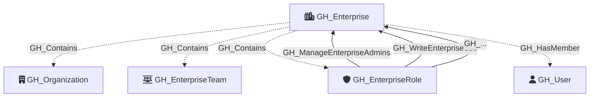

# GH_Enterprise

Represents a GitHub Enterprise account. This is the top-level node in an enterprise collection and serves as the parent container for organizations. Enterprise profile information and billing data are collected via GraphQL.

When a PAT token is provided, additional enterprise policy settings, code security settings, Actions permissions, and workflow permissions are collected. The `enterprise.ownerInfo` GraphQL field and the REST endpoints for these settings are not accessible via GitHub App tokens.

Created by: `Git-HoundEnterprise`

## Properties

| Property Name                | Data Type | Description                                                          |
| ---------------------------- | --------- | -------------------------------------------------------------------- |
| objectid                     | string    | The enterprise's GraphQL node ID.                                    |
| name                         | string    | The display name of the enterprise.                                  |
| slug                         | string    | The enterprise's URL-friendly slug identifier.                       |
| database_id                  | integer   | The enterprise's numeric database ID.                                |
| description                  | string    | The enterprise's description.                                        |
| location                     | string    | The enterprise's location.                                           |
| url                          | string    | The HTTP URL for the enterprise.                                     |
| website_url                  | string    | The enterprise's website URL.                                        |
| created_at                   | datetime  | When the enterprise was created.                                     |
| updated_at                   | datetime  | When the enterprise was last updated.                                |
| billing_email                | string    | The enterprise's billing email address.                              |
| security_contact_email       | string    | The enterprise's security contact email address.                     |
| viewer_is_admin              | boolean   | Whether the authenticated token has admin access to the enterprise.  |
| all_licensable_users_count   | integer   | Total number of licensable users and emails.                         |
| total_licenses               | integer   | Total licenses allocated to the enterprise.                          |
| total_available_licenses     | integer   | Number of available (unused) licenses.                               |
| storage_quota                | float     | Storage quota in GB.                                                 |
| storage_usage                | integer   | Storage usage in MB.                                                 |
| storage_usage_percentage     | float     | Percentage of storage quota used.                                    |
| bandwidth_quota              | float     | Bandwidth quota in GB.                                               |
| bandwidth_usage              | integer   | Bandwidth usage in MB.                                               |
| bandwidth_usage_percentage   | float     | Percentage of bandwidth quota used.                                  |
| asset_packs                  | integer   | Number of data packs used.                                           |

### Policy Settings (requires PAT)

| Property Name                                | Data Type | Description                                                                  |
| -------------------------------------------- | --------- | ---------------------------------------------------------------------------- |
| default_repository_permission                | string    | The default repository permission for enterprise members.                    |
| members_can_create_repositories              | string    | Whether members can create repositories.                                     |
| members_can_create_private_repositories      | string    | Whether members can create private repositories.                             |
| members_can_create_public_repositories       | string    | Whether members can create public repositories.                              |
| members_can_create_internal_repositories     | string    | Whether members can create internal repositories.                            |
| members_can_delete_repositories              | string    | Whether members can delete repositories.                                     |
| members_can_delete_issues                    | string    | Whether members can delete issues.                                           |
| members_can_invite_collaborators             | string    | Whether members can invite outside collaborators.                            |
| two_factor_required                          | string    | Whether two-factor authentication is required for enterprise members.        |
| notification_delivery_restriction_enabled    | string    | Whether notification delivery is restricted to verified or approved domains. |
| ip_allow_list_enabled                        | string    | Whether the IP allow list is enabled.                                        |
| ip_allow_list_for_installed_apps_enabled     | string    | Whether the IP allow list is enabled for installed GitHub Apps.              |

### Code Security Settings (requires PAT)

| Property Name                                 | Data Type | Description                                                                  |
| --------------------------------------------- | --------- | ---------------------------------------------------------------------------- |
| advanced_security_enabled_for_new_repos       | boolean   | Whether GitHub Advanced Security is enabled for new repositories.            |
| dependabot_alerts_enabled_for_new_repos       | boolean   | Whether Dependabot alerts are enabled for new repositories.                  |
| secret_scanning_enabled_for_new_repos         | boolean   | Whether secret scanning is enabled for new repositories.                     |
| secret_scanning_push_protection_enabled       | boolean   | Whether secret scanning push protection is enabled for new repositories.     |
| secret_scanning_push_protection_custom_link   | string    | Custom link shown when push protection blocks a push (null if not set).      |
| secret_scanning_non_provider_patterns_enabled | boolean   | Whether non-provider secret scanning patterns are enabled for new repos.     |

### Actions Permissions (requires PAT)

| Property Name                 | Data Type | Description                                                                   |
| ----------------------------- | --------- | ----------------------------------------------------------------------------- |
| actions_enabled_organizations | string    | Which organizations are allowed to use GitHub Actions (all, none, selected).  |
| actions_allowed_actions       | string    | Which actions and reusable workflows are allowed (all, local_only, selected). |
| actions_sha_pinning_required  | boolean   | Whether SHA pinning is required for actions.                                  |

### Workflow Permissions (requires PAT)

| Property Name                        | Data Type | Description                                                               |
| ------------------------------------ | --------- | ------------------------------------------------------------------------- |
| actions_default_workflow_permissions | string    | Default permissions granted to the GITHUB_TOKEN (read or read-write).     |
| actions_can_approve_pull_requests    | boolean   | Whether GitHub Actions can approve pull request reviews.                  |

## Diagram

