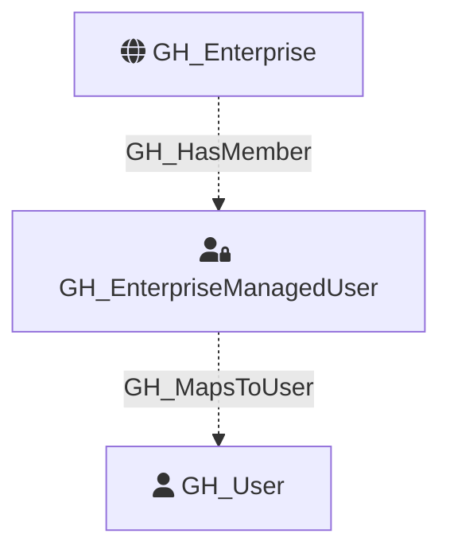

#  GH_EnterpriseManagedUser

Represents a GitHub enterprise-managed account wrapper returned as `EnterpriseUserAccount` from the enterprise members GraphQL API. This node captures the managed account object itself, while a corresponding `GH_User` node represents the traditional GitHub user principal when GitHub returns the nested `user` object.

Created by: `Git-HoundEnterpriseUser`

## Properties

| Property Name  | Data Type | Description |
| -------------- | --------- | ----------- |
| objectid       | string    | The GraphQL `node_id` of the enterprise-managed user account. |
| name           | string    | The managed account login. |
| node_id        | string    | The GraphQL node id. Redundant with objectid. |
| environment_name | string  | The enterprise slug where the managed account was collected. |
| environmentid  | string    | The `GH_Enterprise.node_id` where the managed account was collected. |
| login          | string    | The managed account login. |
| full_name      | string    | The managed account display name. |
| url            | string    | The GitHub URL for the managed account wrapper object when returned by GraphQL. |
| created_at     | string    | When the managed account wrapper object was created. |
| updated_at     | string    | When the managed account wrapper object was last updated. |
| github_user_id | string    | The nested traditional GitHub user id when GitHub returns it. |
| github_username | string   | The nested traditional GitHub username when GitHub returns it. |

Enterprise-managed users are linked to the enterprise with `GH_HasMember` and map to the traditional `GH_User` node with `GH_MapsToUser`.

## Diagram

