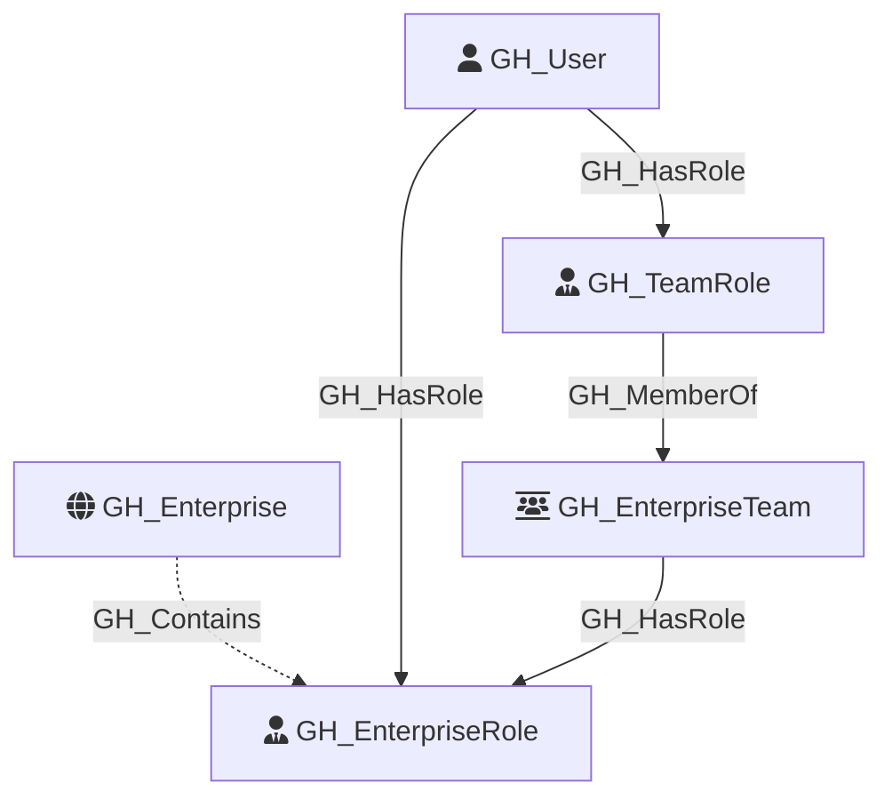

#  GH_EnterpriseRole

Represents an enterprise-level role within a GitHub enterprise. Enterprise roles can be assigned directly to users or to `GH_EnterpriseTeam` nodes, and they preserve the raw permission strings returned by GitHub on the node itself. This keeps the first-pass model lightweight while still surfacing the real enterprise authorization data we collected. GitHound currently creates both REST-enumerated enterprise roles and a default `owners` role populated from `ownerInfo.admins` when PAT-backed enterprise admin data is available.

Created by: `Git-HoundEnterpriseRole`

## Properties

| Property Name    | Data Type | Description |
| ---------------- | --------- | ----------- |
| objectid         | string    | Synthetic ID derived from the enterprise node ID and the GitHub enterprise role ID. |
| name             | string    | Fully qualified role name, for example `k-nexus-global/enterprise_security_manager`. |
| node_id          | string    | Same as objectid. |
| environment_name | string    | The enterprise slug. |
| environmentid    | string    | The enterprise GraphQL node ID. |
| github_role_id   | string    | The raw enterprise role ID returned by the REST API. |
| short_name       | string    | The short display name of the role. |
| description      | string    | The role description returned by GitHub. |
| source           | string    | The origin of the role, such as `Predefined` or `Default`. |
| type             | string    | `default` for predefined/default roles or `custom` for custom enterprise roles. |
| created_at       | datetime  | When the role was created. |
| updated_at       | datetime  | When the role was last updated. |
| permissions      | string[]  | Raw enterprise permission strings returned by GitHub for the role. |

## Diagram

