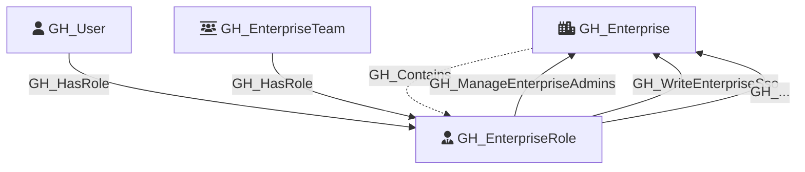

# GH_EnterpriseRole

Represents an enterprise-level role that defines permissions within a GitHub enterprise. Enterprise roles include predefined roles (such as `enterprise_app_manager` and `enterprise_security_manager`), custom roles created by enterprise admins, and the default `owners` and `members` roles. Predefined and custom roles are enumerated from the enterprise roles REST API, while the default owners and members roles are created during enterprise user collection.

The `type` property distinguishes between `default` (built-in and predefined) roles and `custom` roles. The `source` property indicates the origin of the role (e.g., `Predefined` for GitHub-defined roles). Users and enterprise teams can be assigned to roles via `GH_HasRole` edges -- direct user assignments and team assignments are both supported.

Custom enterprise roles have their permissions modeled as edges from the role to the `GH_Enterprise` node. Each permission string from the API (e.g., `manage_enterprise_admins`) is converted to PascalCase and prefixed with `GH_` (e.g., `GH_ManageEnterpriseAdmins`). Predefined roles return empty permission arrays from the API, so no permission edges are created for them.

Created by: `Git-HoundEnterpriseRole`, `Git-HoundEnterpriseUser`

## Properties

| Property Name    | Data Type | Description                                                                              |
| ---------------- | --------- | ---------------------------------------------------------------------------------------- |
| objectid         | string    | Synthetic ID derived from the enterprise node ID and role identifier.                    |
| name             | string    | The fully qualified role name (e.g., `enterprise-slug/role-name`).                       |
| node_id          | string    | Same as objectid.                                                                        |
| environment_name | string    | The enterprise slug.                                                                     |
| environmentid    | string    | The enterprise's GraphQL node ID.                                                        |
| short_name       | string    | The short display name of the role (e.g., `owners`, `members`, or the custom role name). |
| description      | string    | The role's description (null for default owner/member roles).                            |
| source           | string    | The origin of the role (e.g., `Predefined` for GitHub-defined roles; null for default).  |
| type             | string    | `default` for built-in/predefined roles or `custom` for custom enterprise roles.         |
| created_at       | datetime  | When the role was created (null for default owner/member roles).                         |
| updated_at       | datetime  | When the role was last updated (null for default owner/member roles).                    |

## Diagram

